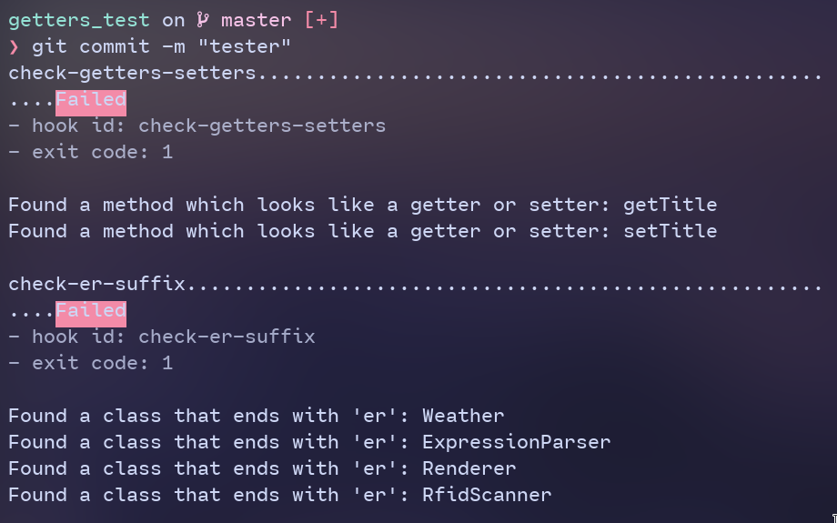

# Pre-commit OOP hooks

A set of pre-commit hooks aiming to detect if certain object oriented programming rules are followed. Those rules are from the oop course at the PUT university in Poland.

## Ruleset

The rules that this pre-commit hook ought to check are the following:

- [X] There should be no classes which end with the suffix "er" 
    - [X] Methods should be exempt from this rule [see here](https://www.wordmom.com/verbs/that-end-with-er)
    - [X] Interfaces should be exempt from this rule
- [X] Getters and Setters should not be allowed (`getValue()`, `setPrimaryKey()`), although library functions (those imported from libraries) are exempt from this rule (`getline()` in C++)

## Using the hook

### Prerequisites

This hook requires you to have `ctags` installed, as it is used to analyze the code files (I have no clue how to do this on windows).

[Pre-commit](https://github.com/pre-commit/pre-commit/) is a must, `ctags` also needs to be installed (but it usually is easily installable with `brew` or your favorite package manager)

### Installation

Create the `.pre-commit-config.yaml` in the root of your git repository.

```yaml
repos:
  - repo: https://github.com/TypicalAM/oop-hooks
    rev: v0.1.0
    hooks:
      - id: check-getters-setters
      - id: check-er-suffix
```

Then run

```bash
pre-commit install
```

And it should work just like that!

## Example output

<p align="center">
    
</p>

# Todos

- [ ] How to explicitly ingore the hook (maybe with a comment along the lines of `oop_checker: ignore`, but then how will `ctags` respond to functions whose definitions span mutltiple lines?)

# Discarded options

Not implementing:

- [ ] There should be no functions which are not object methods (utils functions)
    - Ctags doesn't want to play nice
- [ ] Mutator functions should be named with a verb
- [ ] Accessor functions should be named with a noun
    - Too much ambiguity
